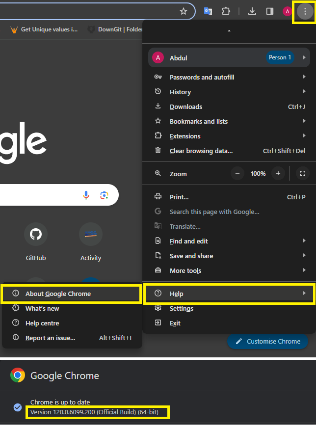

# PENTING!!!
1. Pastikan semua file sudah lengkap, berikut susunan file yang harus ada:
    - `blitzkrieg.py`
    - `blitzkrieg.run.bat` (opsional)
    - `bushido.py`
    - `bushido.run.bat` (opsional)
    - `chromedriver.exe`
    - `credentials.txt`
    - `matkuls.txt`
    - `requirements.txt`
2. Pastikan sudah menginstall Python di komputer Anda. Download [di sini](https://www.python.org/downloads/). Pilih versi Python 3.x.x (disarankan versi terbaru atau versi 3.11 keatas).
3. Pastikan sudah menginstall semua library yang dibutuhkan. Buka terminal/command prompt, lalu ketikkan perintah berikut:
    ```
    pip install -r requirements.txt
    ```
4. Pastikan sudah menginstall [Google Chrome](https://www.google.com/chrome/).
5. Pastikan sudah mendownload [ChromeDriver](https://chromedriver.chromium.org/downloads) dan memindahaknnya ke directory yang sama dengan script bot. Pilih versi yang sesuai dengan versi Google Chrome yang Anda gunakan. Untuk mengetahui versi Google Chrome yang Anda gunakan, buka Google Chrome, lalu klik titik tiga di pojok kanan atas, lalu pilih `Help` > `About Google Chrome`.

6. Pastikan sudah mengisi file `credentials.txt` dan `matkuls.txt` dengan benar. Lihat penjelasan di bawah.
7. Pastikan kondisi jaringan internet Anda stabil.

## Cara Menjalankan
1. Untuk menjalankan script `blitzkrieg.py`, bisa dengan meg-klik 2x file blitzkrieg.py atau file blitzkrieg.run.bat (jika ada), atau bisa juga secara manual melalui terminal/command prompt, dengan menjalankan perintah berikut:
    ```
    python blitzkrieg.py
    ```
2. Untuk menjalankan script `bushido.py`, bisa dengan meg-klik 2x file bushido.py atau file bushido.run.bat (jika ada), atau bisa juga secara manual melalui terminal/command prompt, dengan menjalankan perintah berikut:
    ```
    python bushido.py
    ```

Note: 
- Jika Anda menjalankan script secara manual melalui terminal/command prompt, pastikan Anda berada di direktori yang tepat. Jika tidak, maka Anda akan mendapatkan error.
- script `blitzkrieg.py` dan `bushido.py` memiliki algoritma yang berbeda. Silahkan jalankan kedua script untuk jaga-jaga, setidaknya ada satu script yang berhasil. Namun, sepengalaman penulis, script `bushido.py` yang lebih sering penulis gunakan. Untuk lebih jaga-jaga, boleh jalankan beberapa script yang sama secara bersamaan namun pastinya dengan terminal/command prompt yang berbeda.

### Penjelasan file `credentials.txt` dan `matkuls.txt`
- `credentials.txt` berisi username dan password SIAK Anda. Formatnya adalah sebagai berikut:
    ```
    username
    password
    Display Name
    ```
    Contoh:
    ```
    fulan
    fulan123
    Fulan bin Fulan
    ```
- `matkuls.txt` berisi kode mata kuliah yang ingin Anda ambil. Formatnya adalah sebagai berikut:
    ```
    kode_matkul1-sks,nama_kelas_matkul1
    kode_matkul2-sks,nama_kelas_matkul2
    kode_matkul3-sks,nama_kelas_matkul3
    ```
    Contoh:
    ```
    12345-3,Matkul 1
    67890-2,Matkul 2
    13579-3,Matkul 3
    ```
    Note:
    - Kode mata kuliah dan SKS dipisahkan dengan tanda `-` (strip).
    - Kode mata kuliah bisa di dapatkan dengan mengakses jadwal kuliah yang terdapat di halaman SIAK-NG dengan mengkilk `Jadwal` > `Jadwal Kuliah` kemudian silahkan sesuaikan dengan tahun ajaran dan semester kelas yang anda inginkan, atau bisa langusng dengan menuju link [https://academic.ui.ac.id/main/Schedule/Index](https://academic.ui.ac.id/main/Schedule/Index). Setelah itu silahkan klik mata kuliah yang ingin Anda ambil, lalu lihat pada URL, kode mata kuliah terdapat pada bagian akhir URL, setelah `cc=`. Contoh: `https://academic.ui.ac.id/main/CoursePlan/ClassInfo?cc=724681`, maka kode mata kuliahnya adalah `724681` untuk kelas `Aljabar Linier C`. Jika anda kesusahan dengan cara ini, anda bisa menuju ke link [ini](), penulis sudah membuatkan form untuk mengenerate matkuls.txt sesuai dengan kelas yang dipilih.

